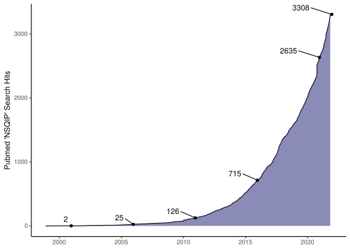
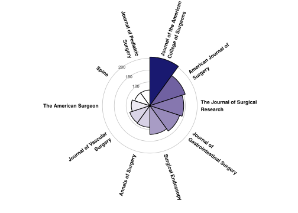

<!-- README.md is generated from README.Rmd. Please edit that file -->

# nsqipr 

<!-- badges: start -->

[](https://github.com/dylanrussellmd/nsqipr/actions)

<!-- badges: end -->

What would you like to see implemented in `nsqipr`? [Open an
issue](https://github.com/doctortickle/nsqipr/issues)\! Are you
interested in using or helping develop `nsqipr`? [Send me an
email](dyl.russell@gmail.com)\!

# About ACS NSQIP<sup>©</sup>

Welcome to `nsqipr`\! If you’re reading this, you are likely already
familiar with the American College of Surgeons National Surgical Quality
Improvement Program (**ACS NSQIP**<sup>©</sup>). If not, you can read
about it [here](https://www.facs.org/quality-programs/acs-nsqip). The
ACS NSQIP <sup>©</sup> is a nationally validated, risk-adjusted,
outcomes-based program to measure and improve the quality of surgical
care.

As of 28 October, 2021, there are currently [700
hospitals](https://www.facs.org/search/nsqip-participants?allresults=)
that participate in and contribute to the program. The entire database
contains **more than 8 million cases** for data analysis.

## Inclusion and Exclusion Criteria

ACS NSQIP<sup>©</sup> captures and reports 30-day morbidity and
mortality outcomes for all major inpatient and outpatient surgical
procedures as determined by Current Procedural Terminology
(CPT<sup>©</sup>) code. This list is updated annually as new codes
become available. Excluded cases are:

  - Patients under the age of 18 years.
  - \>3 inguinal herniorrhaphies in an 8-day period.
  - \>3 breast lumpectomies in an 8-day period.
  - \>3 laparoscopic cholecystectomies in an 8-day period.
  - \>3 TURPs and/or TURBTs in an 8-day period.

## Publications

The data from ACS NSQIP<sup>©</sup> is used to produce an exponentially
increasing number of publications per year. As of 28 October, 2021,
there are currently [3308 PubMed search
results](https://pubmed.ncbi.nlm.nih.gov/?term=NSQIP) for the search
term “NSQIP”.



These papers are often published in high quality journals. The following
graph shows the top 10 most common journals in which the above search
results were published.



# About `nsqipr`

## Purpose

ACS NSQIP<sup>©</sup> requires that members request specific datasets
for use in research. The files are then delivered as `.exe` executable
files available for download for a limited duration of time. The
archived files can be unzipped and contain a `.txt` tab-delimited file.
Some will also contain a PDF version of the Participant Use File
(**PUF**); these define the variables in the dataset. The `.txt`
tab-delimited file must be read into R as a data frame and meticulously
cleaned prior to being used for data analysis. Researchers often want to
combine data across multiple years. This complicates data preparation as
variables are removed or added every year and sometimes the same
variable may have differently worded outcomes between years.

<table class="table table-striped table-condensed" style="font-size: 14px; width: auto !important; margin-left: auto; margin-right: auto;">

<thead>

<tr>

<th style="text-align:left;">

race (2005-2006)

</th>

<th style="text-align:left;">

race\_new (2019)

</th>

</tr>

</thead>

<tbody>

<tr>

<td style="text-align:left;">

American Indian or Alaska Native

</td>

<td style="text-align:left;">

American Indian or Alaska Native

</td>

</tr>

<tr>

<td style="text-align:left;">

Asian or Pacific Islander

</td>

<td style="text-align:left;">

Asian

</td>

</tr>

<tr>

<td style="text-align:left;">

Black, Not of Hispanic Origin

</td>

<td style="text-align:left;">

Black or African American

</td>

</tr>

<tr>

<td style="text-align:left;">

Hispanic, Black

</td>

<td style="text-align:left;">

Native Hawaiian or Pacific Islander

</td>

</tr>

<tr>

<td style="text-align:left;">

Hispanic, Color Unknown

</td>

<td style="text-align:left;">

Unknown/Not Reported

</td>

</tr>

<tr>

<td style="text-align:left;">

Hispanic, White

</td>

<td style="text-align:left;">

White

</td>

</tr>

<tr>

<td style="text-align:left;">

Unknown

</td>

<td style="text-align:left;">

</td>

</tr>

<tr>

<td style="text-align:left;">

White, Not of Hispanic Origin

</td>

<td style="text-align:left;">

</td>

</tr>

</tbody>

</table>

The purpose of `nsqipr` is to streamline this process. This package is
geared towards those surgical interns, residents, and attendings who
have limited experience with R, SQL, or “big data” analysis. It is also
designed to be a useful tool for that experienced researcher or computer
scientist making frequent use of ACS NSQIP<sup>©</sup> PUFs.

For a detailed dive into `nsqipr`, please refer to the [companion
book](https://www.dylanrussellmd.com/nsqipr_book) or the documentation:

``` r
help("nsqipr")
```

## Installation

You can install or upgrade `nsqipr` with:

``` r
devtools::install_github("dylanrussellmd/nsqipr")
```

We are not (yet) available on CRAN.

## Use

1.  Execute all `.exe` executable files from ACS NSQIP<sup>©</sup> in a
    single directory (`dir`) (do not change the default file names).
2.  Now simply run `nsqip(dir)`.

`nsqipr` will take care of the rest. You’re now ready to use the ACS
NSQIP<sup>©</sup> data for data analysis\!

## Progress

Track progress on how the various data sets are being incorporated into
`nsqipr` here.

  - Main PUF - <span style="color: midnightblue;">Done, Documented,
    Tested</span>
  - Vascular - <span style="color: goldenrod;">In progress, use with
    caution</span>
      - Abdominal Aortic Aneurysm - <span style="color: goldenrod;">In
        progress, use with caution</span>
      - Aortoiliac Endovascular - <span style="color: goldenrod;">In
        progress, use with caution</span>
      - Aortoiliac Open - <span style="color: goldenrod;">In progress,
        use with caution</span>
      - Carotid Artery Stenting - <span style="color: maroon;">Not
        started</span>
      - Carotid Endarterectomy - <span style="color: maroon;">Not
        started</span>
      - Endovascular Aneurysm Repair - <span style="color: maroon;">Not
        started</span>
      - Lower Extremity Endovascular - <span style="color: maroon;">Not
        started</span>
      - Lower Extremity Open - <span style="color: maroon;">Not
        started</span>
  - Colectomy - <span style="color: goldenrod;">In progress, use with
    caution</span>
  - Pancreatectomy - <span style="color: goldenrod;">In progress, use
    with caution</span>
  - Proctectomy - <span style="color: maroon;">Not started</span>
  - Hepatectomy - <span style="color: goldenrod;">In progress, use with
    caution</span>
  - Thyroidectomy - <span style="color: maroon;">Not started</span>
  - Esophagectomy - <span style="color: maroon;">Not started</span>
  - Appendectomy - <span style="color: goldenrod;">In progress, use with
    caution</span>
  - Gynecology - <span style="color: maroon;">Not started</span>
  - Hysterectomy - <span style="color: maroon;">Not started</span>
  - Hip Fracture - <span style="color: maroon;">Not started</span>
  - Cystectomy - <span style="color: maroon;">Not started</span>
  - Nephrectomy - <span style="color: maroon;">Not started</span>
  - Prostatectomy - <span style="color: maroon;">Not started</span>

Check back often for updates\!
