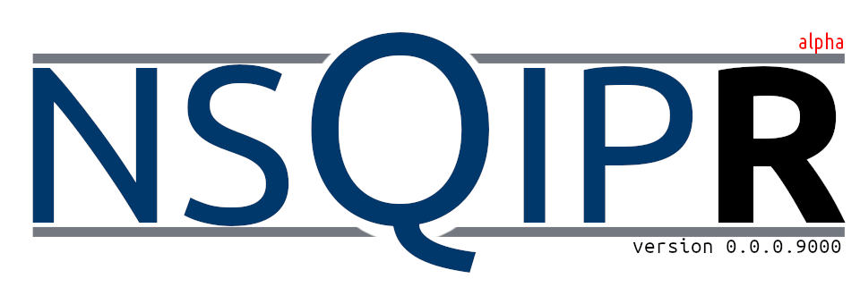
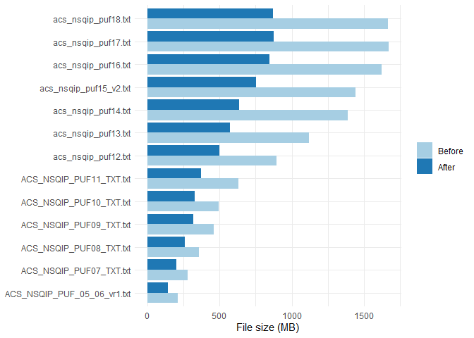

<!-- README.md is generated from README.Rmd. Please edit that file -->

<!-- badges: start -->

[](https://travis-ci.com/dylanrussellmd/nsqipr)

<!-- badges: end -->



What would you like to see implemented in `nsqipr`? [Open an
issue](https://github.com/doctortickle/nsqipr/issues)\! Are you
interested in using or helping develop `nsqipr`? [Send me an
email](dyl.russell@gmail.com)\!

# About ACS NSQIP<sup>©</sup>

Welcome to `nsqipr`\! If you’re reading this, you are likely already
familiar with the American College of Surgeons National Surgical Quality
Improvement Program (**ACS NSQIP**<sup>©</sup>). If not, you can read
about it [here](https://www.facs.org/quality-programs/acs-nsqip). The
ACS NSQIP <sup>©</sup> is a nationally validated, risk-adjusted,
outcomes-based program to measure and improve the quality of surgical
care.

As of 2020-08-23, there are currently [706
hospitals](https://www.facs.org/search/nsqip-participants?allresults=)
that participate in and contribute to the program. The entire database
contains **more than 6.6 million cases** for data analysis.

## Inclusion and Exclusion Criteria

ACS NSQIP<sup>©</sup> captures and reports 30-day morbidity and
mortality outcomes for all major inpatient and outpatient surgical
procedures as determined by Current Procedural Terminology
(CPT<sup>©</sup>) code. This list is updated annually as new codes
become available. Excluded cases are:

  - Patients under the age of 18 years.
  - \>3 inguinal herniorrhaphies in an 8-day period.
  - \>3 breast lumpectomies in an 8-day period.
  - \>3 laparoscopic cholecystectomies in an 8-day period.
  - \>3 TURPs and/or TURBTs in an 8-day period.

## Publications

The data from ACS NSQIP<sup>©</sup> is used to produce **approximately
400 publications per year**. As of 2020-08-23, there are currently
[2,728 publications](https://pubmed.ncbi.nlm.nih.gov/?term=nsqip)
analyzing the ACS NSQIP<sup>©</sup> database.

# About `nsqipr`

## Purpose

ACS NSQIP<sup>©</sup> requires that members request specific datasets
for use in research. The files are then delivered as `.exe` executables
avaiable for download for a limited duration of time. The archived files
can be unzipped and contain a `.txt` tab-delimited file. Some will also
contain a PDF version of the Participant Use File (**PUF**); these
define the variables in the dataset. The `.txt` tab-delimited file must
be read into R as a data frame and meticulously cleaned prior to being
used for data analysis. Researchers often want to combine data across
multiple years. This complicates data preparation as variables are
removed or added every year and sometimes the same variable may be
recorded differently in two different years.

The purpose of `nsqipr` is to streamline this process. This package is
geared towards those surgical interns, residents, and attendings who
have limited experience with `R`, `SQL`, or “big data” analysis. It is
also designed to be a useful tool for that experienced researcher or
computer scientist making frequent use of ACS NSQIP<sup>©</sup> PUFs.

## Installation

You can install or upgrade `nsqipr` with:

``` r
devtools::install_github("dylanrussellmd/nsqipr")
```

We are not (yet) available on CRAN.

## Use

1.  Excute all `.exe` executable files from ACS NSQIP<sup>©</sup> in a
    single directory (`dir`) (do not change the default file names).
2.  Now simply run `nsqip(dir)`.

`nsqipr` will take care of the rest. You’re now ready to use the ACS
NSQIP<sup>©</sup> data for data analysis\!

## Variables

TODO: Build example table of raw variables, clean variables, and type

## File Size

`nsqipr` significant reduces file sizes after cleaning the data.


